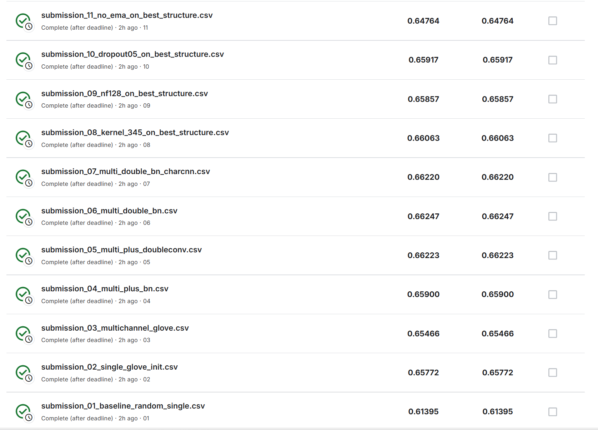

# TextCNN 电影评论情感分析

基于 PyTorch 实现的 TextCNN 模型，用于 SST-5（Stanford Sentiment Treebank）数据集的情感分析任务。本项目实现了多种高级特性，包括多通道嵌入、字符级 CNN、标签平滑和 EMA（指数移动平均）。

## 目录

- [特性](#特性)
- [项目结构](#项目结构)
- [环境要求](#环境要求)
- [安装](#安装)
- [数据集](#数据集)
- [使用方法](#使用方法)
  - [基础训练](#基础训练)
  - [使用 GloVe 嵌入训练](#使用-glove-嵌入训练)
  - [超参数搜索](#超参数搜索)
  - [批量实验](#批量实验)
  - [生成预测](#生成预测)
  - [批量预测](#批量预测)
- [模型架构](#模型架构)
- [高级特性](#高级特性)
- [实验结果](#实验结果)

## 特性

- **多通道 CNN**：实现 Kim (2014) 的多通道架构，包含静态和非静态嵌入
- **字符级 CNN**：可选的字符级特征，更好地处理罕见词
- **预训练嵌入**：支持 GloVe 词向量
- **高级训练技术**：
  - 标签平滑
  - 类别权重处理不平衡数据
  - EMA（指数移动平均）模型权重
  - Warmup + 余弦退火学习率调度
  - OneCycleLR 调度器选项
  - 梯度裁剪
  - 词级 dropout 正则化
- **灵活的架构**：
  - 可配置的卷积核大小
  - BatchNorm 支持
  - 双层卷积
  - 投影层选项
- **实验管理**：
  - 自动化超参数搜索
  - 批量实验运行器用于不同优化方式组合/消融研究
  - 全面的日志和结果跟踪

## 项目结构

根据提交要求，不打包数据集和较大的模型参数，故提交的作业压缩包中，data、checkpoints为空文件夹，exp_runs_report中只有log文件。预训练词表也因文件较大没有放入其中

```
assignment/
├── text_cnn.py              # 主模型实现和训练脚本
├── text_cnn_predict.py      # 单模型预测脚本
├── hyperparam_search.py     # 超参数网格搜索
├── run_experiments.py       # 批量实验运行器（不同优化方式组合/消融研究）
├── batch_predict.py         # 多模型批量预测
├── data/
│   ├── train.tsv           # 训练数据
│   └── test.tsv            # 测试数据
├── checkpoints/            # 保存的模型检查点
├── exp_runs_report/        # 实验日志和结果
├── submissions/            # （单次预测）生成的预测文件
├── Readme.md              # 本文件
└── image/		   # Readme里包含的实验结果截图文件所在位置
```

## 环境要求

- Python 3.8+
- PyTorch 1.10+
- pandas
- numpy

## 安装

1. 克隆或下载本仓库
2. 创建虚拟环境（推荐）：

```bash
python -m venv .venv
# Windows 系统
.venv\Scripts\activate
# Linux/Mac 系统
source .venv/bin/activate
```

3. 安装依赖：

```bash
pip install torch pandas numpy
```

## 数据集

本项目使用 SST-5（Stanford Sentiment Treebank）数据集进行 5 分类情感分析：

- 0: 非常消极
- 1: 消极
- 2: 中性
- 3: 积极
- 4: 非常积极

数据集应为 TSV 格式，包含以下列：

- `train.tsv`: `PhraseId`, `SentenceId`, `Phrase`, `Sentiment`
- `test.tsv`: `PhraseId`, `SentenceId`, `Phrase`

## 使用方法

### 基础训练

使用默认参数训练基础 TextCNN 模型：

```bash
python text_cnn.py --train_path data/train.tsv --save_path checkpoints/model.pt
```

### 使用 GloVe 嵌入训练

使用预训练的 GloVe 词向量进行训练：

```bash
python text_cnn.py \
    --train_path data/train.tsv \
    --glove_path path/to/glove.txt \
    --glove_dim 300 \
    --embed_dim 300 \
    --use_multichannel \
    --save_path checkpoints/model_glove.pt
```

### 主要训练参数

```bash
# 数据参数
--train_path PATH           # 训练 TSV 文件路径（默认：data/train.tsv）
--val_ratio FLOAT          # 验证集划分比例（默认：0.1）
--max_vocab_size INT       # 最大词汇表大小（默认：60000）
--min_freq INT             # 最小词频（默认：2）

# 模型架构
--embed_dim INT            # 嵌入维度（默认：256）
--num_filters INT          # 每个卷积核的滤波器数量（默认：256）
--kernel_sizes STR         # 逗号分隔的卷积核大小（默认："2,3,4,5,7"）
--dropout FLOAT            # Dropout 概率（默认：0.5）
--use_multichannel         # 使用多通道嵌入（需要 GloVe）
--use_batchnorm           # 在卷积后应用 BatchNorm
--use_double_conv         # 使用双层卷积块
--proj_dim INT            # 投影维度（0 表示禁用，默认：0）

# 字符级 CNN
--use_char_cnn            # 启用字符级 CNN
--char_max_len INT        # 每个短语的最大字符数（默认：200）
--char_embed_dim INT      # 字符嵌入维度（默认：50）
--char_num_filters INT    # 字符级滤波器数量（默认：50）

# 训练参数
--batch_size INT          # 批次大小（默认：128）
--epochs INT              # 训练轮数（默认：30）
--lr FLOAT                # 学习率（默认：1e-3）
--weight_decay FLOAT      # 权重衰减（默认：1e-4）
--grad_clip FLOAT         # 梯度裁剪最大范数（默认：5.0）

# 高级训练
--use_class_weights       # 使用类别权重处理不平衡数据
--label_smoothing FLOAT   # 标签平滑因子（默认：0.05）
--use_ema                 # 使用模型权重的 EMA
--ema_decay FLOAT         # EMA 衰减因子（默认：0.995）
--word_dropout FLOAT      # 词级 dropout（默认：0.05）

# 学习率调度
--use_one_cycle           # 使用 OneCycleLR 调度器
--max_lr FLOAT            # OneCycle 的最大学习率（默认：3e-3）
--warmup_epochs INT       # 预热轮数（默认：2）
--min_lr FLOAT            # 余弦衰减的最小学习率（默认：1e-5）

# 其他
--early_stop_patience INT # 早停耐心值（默认：8）
--k_folds INT             # K 折交叉验证（默认：1）
--seed INT                # 随机种子（默认：42）
--save_path PATH          # 模型保存路径（默认：checkpoints/text_cnn.pt）
```

### 超参数搜索

运行超参数网格搜索：

```bash
python hyperparam_search.py --seeds 42 43 44 --glove_path path/to/glove.txt
```

脚本搜索的超参数范围：

- 学习率：[5e-4, 7e-4, 1e-3]
- Dropout：[0.5, 0.6]
- 最大长度：[80, 100, 120]
- 滤波器数量：[200, 256]
- 嵌入维度：[200, 300]

结果会在多个随机种子上平均，并报告最佳配置。

### 批量实验

运行多个实验进行消融研究：

```bash
python run_experiments.py --python python --out_dir exp_runs_report
```

该脚本运行 12 个预定义实验，比较不同的模型配置：

1. 随机初始化基线
2. 单通道 GloVe 初始化
3. 多通道 GloVe
4. 多通道 + BatchNorm
5. 多通道 + 双层卷积
6. 多通道 + 双层卷积 + BatchNorm
7. 多通道 + 双层卷积 + BatchNorm + 字符级 CNN
8. 不同的卷积核大小 (3,4,5)
9. 更少的滤波器 (128)
10. 更高的 dropout (0.5)
11. 不使用 EMA

选项：

```bash
--python PATH              # Python 可执行文件（默认：python）
--train_script PATH        # 训练脚本（默认：text_cnn.py）
--out_dir PATH            # 输出目录（默认：exp_runs_report）
--dry_run                 # 仅打印命令不执行
--fast                    # 使用更少轮数快速测试
```

结果保存到 `exp_runs_report/results.csv`，日志保存在各个实验文件夹中。

### 生成预测

使用训练好的模型在测试数据上生成预测：

```bash
python text_cnn_predict.py \
    --checkpoint checkpoints/model.pt \
    --test_path data/test.tsv \
    --output_path submission.csv \
    --batch_size 256
```

### 批量预测

为批量实验中的所有模型生成预测：

```bash
python batch_predict.py \
    --runs_dir exp_runs_report \
    --test_path data/test.tsv \
    --out_dir submissions \
    --batch_size 256
```

该脚本会自动找到所有实验检查点并为每个模型生成提交文件。

## 模型架构

### TextCNN 基础架构

模型实现了 Kim (2014) 的 CNN 架构：

1. **嵌入层**：将词索引转换为密集向量
2. **卷积层**：多个不同卷积核大小的 1D 卷积
3. **最大池化**：对每个特征图进行全局最大池化
4. **全连接层**：分类层

### 多通道架构

当启用 `--use_multichannel` 时：

- 两个嵌入通道：静态（冻结）和非静态（可训练）
- 两者都用预训练的 GloVe 嵌入初始化
- 在卷积前拼接

### 字符级 CNN

当启用 `--use_char_cnn` 时：

- 独立的 CNN 分支处理字符序列
- 字符嵌入 → Conv1D → 最大池化
- 与词级特征拼接

### 双层卷积

当启用 `--use_double_conv` 时：

- 第一层卷积，卷积核大小为 k
- 第二层卷积，卷积核大小为 1
- 增加非线性和模型容量

## 高级特性

### 标签平滑

通过平滑目标分布防止过度自信：

```
y_smooth = (1 - α) * y_true + α / K
```

### 类别权重

通过对每个类别加权来处理类别不平衡：

```
weight_i = max_count / count_i
```

### EMA（指数移动平均）

维护一个权重指数衰减的影子模型：

```
θ_ema = decay * θ_ema + (1 - decay) * θ_model
```

### 学习率调度

**Warmup + 余弦退火**（默认）：

- 前 N 轮线性预热
- 余弦衰减到最小学习率

**OneCycleLR**（使用 `--use_one_cycle`）：

- 在训练的前 30% 将学习率提升到 max_lr
- 使用余弦退火降低到 min_lr

### 词级 Dropout

训练时随机丢弃词进行正则化：

```python
tokens = [t for t in tokens if random.random() > word_dropout]
```

## 实验结果（部分）



## 性能优化

1. **使用预训练嵌入**：GloVe 嵌入可显著提升性能
2. **启用多通道**：允许同时使用静态和可训练嵌入
3. **添加 BatchNorm**：稳定训练并提高泛化能力
4. **使用 EMA**：提供更稳定的预测
5. **调整学习率**：尝试 OneCycleLR 以加快收敛
6. **调整 dropout**：对于较大模型使用更高的 dropout（0.5-0.6）
7. **字符级 CNN**：有助于处理罕见词和拼写错误
8. **类别权重**：对于不平衡数据集很重要

## 故障排除

**内存不足**：

- 减小 `--batch_size`
- 减小 `--num_filters`
- 减小 `--max_len` 或 `--char_max_len`

**过拟合**：

- 增大 `--dropout`
- 增大 `--word_dropout`
- 启用 `--label_smoothing`
- 减小模型容量

**欠拟合**：

- 增大 `--num_filters`
- 添加 `--use_double_conv`
- 增加 `--epochs`
- 减小 `--dropout`

**训练缓慢**：

- 增大 `--batch_size`
- 使用 `--use_one_cycle` 加快收敛
- 减小 `--max_len`
